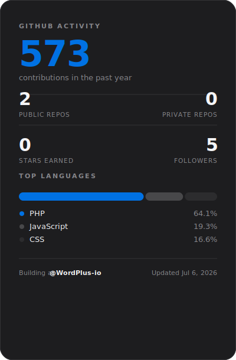

<table>
<tr>
<td valign="top" width="58%">

# Rajesh Rathod
### Design Engineer

I move between Figma and the codebase without treating them as separate jobs — I design the system, then build the thing that ships it.

Currently building **[Wordplus Studio](https://github.com/WordPlus-io)** in Pune, and studying Economics on the side because I like knowing why a market behaves the way it does, not just how to build for it.

 

**What I actually do**

- Design systems in Figma (variables, component properties, slot patterns) that survive contact with real code
- WordPress at the architecture level — FSE, ACF Pro, custom post types, block development, WP-CLI
- Full-stack product builds — React/TypeScript on the front, Node.js/Express + PostgreSQL underneath
- Organizing WordCamp Pune and the local WordPress meetup — the community side of the same craft

 

**Selected builds**

| Project | What it is |
|---|---|
| **AuthKit** | Multi-method authentication plugin for Framer — React/TS + Node/Express + PostgreSQL |
| **PixelLens** | Chrome extension color picker — six color formats, built-in WCAG contrast checking |
| **NarratIQ** | AI reading companion with Hindi/Marathi NLP support, built around the Gemini API |
| **OTPulse** | Multi-channel OTP-as-a-service — Node/Express, PostgreSQL, Redis, Next.js |

 

**Find me elsewhere**
[Portfolio](https://rajeshrathod.com) · [LinkedIn](https://www.linkedin.com/in/rajeshrathodcom) · [Wordplus Studio](https://github.com/WordPlus-io)

</td>
<td valign="top" width="42%" align="center">

</td>

  <!-- 5. GITHUB PROFILE VIEWS (At the very bottom) -->
  

</tr>
</table>
